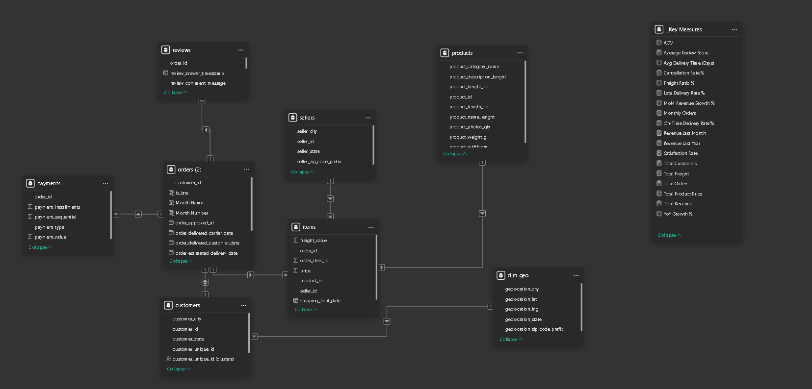

<div align="center">
```
 ██████╗ ██╗     ██╗███████╗████████╗
██╔═══██╗██║     ██║██╔════╝╚══██╔══╝
██║   ██║██║     ██║███████╗   ██║   
██║   ██║██║     ██║╚════██║   ██║   
╚██████╔╝███████╗██║███████║   ██║   
 ╚═════╝ ╚══════╝╚═╝╚══════╝   ╚═╝  
```

# 🛒 Brazilian E-Commerce Analytics Pipeline
### *End-to-End Data Engineering & Analytics on the Olist Dataset*

<br>

[](https://www.python.org/)
[](https://www.microsoft.com/en-us/sql-server)
[](https://jupyter.org/)
[](https://pandas.pydata.org/)
[](https://scikit-learn.org/)
[](https://www.kaggle.com/datasets/olistbr/brazilian-ecommerce)

</div>

---

## 📌 Project Overview

This project delivers a **full analytics pipeline** on the [Olist Brazilian E-Commerce Dataset](https://www.kaggle.com/datasets/olistbr/brazilian-ecommerce) — one of the most comprehensive e-commerce public datasets available, containing **100K+ real orders** placed between 2016–2018 across Brazil.

The project is structured in two interconnected layers:

| Layer | Tool | Description |
|---|---|---|
| 🐍 **Analytics & EDA** | Python / Jupyter | Data loading, cleaning, EDA, segmentation, and export |
| 🏗️ **Data Warehouse** | SQL Server | Staging → Star Schema → BI-ready Fact & Dimension tables |

---

## 🗂️ Dataset Structure

The Olist dataset consists of **9 relational CSV tables** representing the full e-commerce ecosystem:

```
Customer ──► Order ──► Order_Items ──► Product ──► Sellers
                 │
                 ├──► Order_Payment
                 ├──► Order_Reviews
                 └──► Geolocation
                           │
                    Product_Category
```

| # | Table | Key Info |
|---|---|---|
| 1 | `olist_customers_dataset` | Customer ID, city, state |
| 2 | `olist_orders_dataset` | Order lifecycle timestamps |
| 3 | `olist_order_payments_dataset` | Payment types & values |
| 4 | `olist_order_items_dataset` | Items, prices, freight |
| 5 | `olist_products_dataset` | Product dimensions & category |
| 6 | `product_category_name_translation` | PT → EN category names |
| 7 | `olist_sellers_dataset` | Seller location data |
| 8 | `olist_geolocation_dataset` | ZIP → lat/lng coordinates |
| 9 | `olist_order_reviews_dataset` | Review scores + comments |

---

## 🏗️ Data Warehouse (SQL Server)

> 🗄️ **SQL Script:** [`Olist_DWH.sql`](./Olist_DWH.sql)

A complete **ETL pipeline** implemented in T-SQL, following the **Galaxy Schema** design pattern.

### Architecture

<!-- 📸 Add your Star Schema diagram screenshot below (from SSMS, draw.io, dbdiagram.io, etc.) -->


### Tables

#### 📦 Staging (Raw Ingestion)
```sql
stg_customers    →  Customer raw data
stg_orders       →  Order lifecycle data
stg_order_items  →  Line-item level data
```

#### ⭐ Dimension Tables
| Table | Key | Description |
|---|---|---|
| `Dim_Customers` | `CustomerKey` (IDENTITY) | Deduplicated customer master |
| `Dim_Date` | `DateKey` (YYYYMMDD INT) | Full calendar dimension |

#### 📊 Fact Table
| Column | Type | Notes |
|---|---|---|
| `SalesKey` | INT IDENTITY | Surrogate PK |
| `order_id` | VARCHAR(50) | Business key |
| `CustomerKey` | INT FK | → Dim_Customers |
| `OrderDateKey` | INT FK | → Dim_Date |
| `price` | DECIMAL(18,2) | Item price |
| `freight_value` | DECIMAL(18,2) | Shipping cost |
| `TotalAmount` | **Computed** | `price + freight_value` (PERSISTED) |

### ETL Flow
```
1. BULK INSERT CSVs → Staging tables (UTF-8, CSV format)
2. INSERT DISTINCT → Dim_Customers
3. INSERT DISTINCT → Dim_Date  (format: YYYYMMDD integer key)
4. JOIN & INSERT  → Fact_Sales (stg_order_items ⋈ stg_orders ⋈ Dim_Customers)
```

---

## 🛠️ Tech Stack

```
Data Engineering    →  SQL Server 2019+, T-SQL, BULK INSERT
Data Analysis       →  Python 3.10+, Pandas, NumPy
Visualization       →  Matplotlib, Seaborn, WordCloud
ML / Preprocessing  →  Scikit-learn (IterativeImputer, RobustScaler)
Statistics          →  SciPy (skew, kurtosis, winsorize)
BI Export           →  Power BI (via Star Schema CSVs)
Environment         →  Jupyter Notebook, Kaggle
```

---

## 🚀 Getting Started

### Prerequisites

```bash
pip install pandas numpy matplotlib seaborn scikit-learn scipy wordcloud nltk kagglehub missingno
```

### Run the Notebook

```bash
# 1. Clone the repository
git clone https://github.com/your-username/olist-analytics.git
cd olist-analytics

# 2. Launch Jupyter
jupyter notebook Olist_dataset_project.ipynb
```

### Set Up the Data Warehouse

```sql
-- Run in SQL Server Management Studio (SSMS)
-- Update file paths in BULK INSERT statements to match your local CSV directory

-- Then execute:
-- 1. Create DB & Staging tables
-- 2. BULK INSERT CSVs
-- 3. Create Star Schema
-- 4. Run Transform & Load
```

> ⚠️ Update the CSV paths in [`Olist_DWH.sql`](./Olist_DWH.sql) to match your local directory before running BULK INSERT statements.

---

## 📁 Repository Structure

```
olist-analytics/
│
├── 📓 Olist_dataset_project.ipynb   # Full EDA & analytics notebook
├── 🗄️  Olist_DWH.sql                # SQL Server DWH (ETL + Star Schema)
├── 📄 README.md                     # You are here
│
├── 📂 images/                       # Screenshots & diagrams for README
│   ├── missing_values.png           # Missing values heatmap
│   ├── univariate_analysis.png      # Price / review score distributions
│   ├── bivariate_analysis.png       # Relationship charts
│   ├── correlation_heatmap.png      # Feature correlation matrix
│   ├── customer_segmentation.png    # RFM cluster plot
│   └── star_schema.png              # DWH schema diagram
│
└── 📂 data/                         # (Download from Kaggle — not committed)
    ├── olist_customers_dataset.csv
    ├── olist_orders_dataset.csv
    ├── olist_order_items_dataset.csv
    ├── olist_order_payments_dataset.csv
    ├── olist_products_dataset.csv
    ├── olist_sellers_dataset.csv
    ├── olist_geolocation_dataset.csv
    ├── olist_order_reviews_dataset.csv
    └── product_category_name_translation.csv
```

---

## 📊 Key Findings (Highlights)

- 🛍️ **100K+ orders** analyzed across 2016–2018
- ⭐ **Review silence is a signal** — missing comments strongly predict 5-star ratings
- 💸 **Price distribution is highly right-skewed** (Skew > 5) — driven by a small number of luxury/large items
- 🚚 **~2.8% missing delivery dates** trace directly to canceled or unavailable orders
- 🗺️ Customer base spans all 26 Brazilian states + Federal District

---

## 🤝 Contributing

Pull requests are welcome. For major changes, please open an issue first to discuss what you'd like to change.

---

## 📜 License

This project is licensed under the MIT License.

---

<div align="center">

**Dataset Source:** [Olist Brazilian E-Commerce — Kaggle](https://www.kaggle.com/datasets/olistbr/brazilian-ecommerce)

*Built with ❤️ for data engineering & analytics*

</div>
